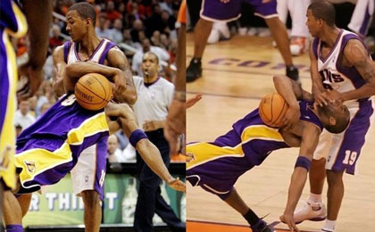



<!-- Read [Jekyll Quick Start](http://jekyllbootstrap.com/usage/jekyll-quick-start.html)

Complete usage and documentation available at: [Jekyll Bootstrap](http://jekyllbootstrap.com)

## Update Author Attributes

In `_config.yml` remember to specify your own data:
    
    title : My Blog =)
    
    author :
      name : Name Lastname
      email : blah@email.test
      github : username
      twitter : username

The theme should reference these variables whenever needed.
    
## Sample Posts

This blog contains sample posts which help stage pages and blog data.
When you don't need the samples anymore just delete the `_posts/core-samples` folder.

    $ rm -rf _posts/core-samples

Here's a sample "posts list". -->

	

		

			

			

				
<a href="###">热火球市比马刺火爆 总决赛最高票价36000元</a>

				
腾讯体育6月5日讯 看一场总决赛需要多少钱？美国票务网站就更新了总决赛最新门票价格，最便宜的你花246美元就能够看一场总决赛。当然，如果你想要坐在场边观看，那门票可是价格不菲，最高需要5801美元，折合人民币约为36252元。

以该网站公布的数据来看，热火的球市显然要比马刺火爆。首先是热火剩余球票的张数要比马刺更少，其次是他们的门票均价和单场最高门票价格也要更高。当然，出现这样的场景也是完全可以理解的。圣安东尼奥毕竟是小市场，而在迈阿密的比赛往往能吸引很多的名流和富人。

			

		

		

			

			

				
<a href="###">热火球市比马刺火爆 总决赛最高票价36000元</a>

				
腾讯体育6月5日讯 看一场总决赛需要多少钱？美国票务网站就更新了总决赛最新门票价格，最便宜的你花246美元就能够看一场总决赛。当然，如果你想要坐在场边观看，那门票可是价格不菲，最高需要5801美元，折合人民币约为36252元。

以该网站公布的数据来看，热火的球市显然要比马刺火爆。首先是热火剩余球票的张数要比马刺更少，其次是他们的门票均价和单场最高门票价格也要更高。当然，出现这样的场景也是完全可以理解的。圣安东尼奥毕竟是小市场，而在迈阿密的比赛往往能吸引很多的名流和富人。

			

		

	

	

		

		

			

				
<a href="###">詹姆斯：体育界我最易被批 名宿教我对付詹黑</a>

			

			

				
<a href="###">詹姆斯：体育界我最易被批 名宿教我对付詹黑</a>

			

			

				
<a href="###">詹姆斯：体育界我最易被批 名宿教我对付詹黑</a>

			

			

				
<a href="###">詹姆斯：体育界我最易被批 名宿教我对付詹黑</a>

			

			

				
<a href="###">詹姆斯：体育界我最易被批 名宿教我对付詹黑</a>

			

		

		

		

		

			

				
<a href="###">詹姆斯：体育界我最易被批 名宿教我对付詹黑</a>

			

			

				
<a href="###">詹姆斯：体育界我最易被批 名宿教我对付詹黑</a>

			

			

				
<a href="###">詹姆斯：体育界我最易被批 名宿教我对付詹黑</a>

			

			

				
<a href="###">詹姆斯：体育界我最易被批 名宿教我对付詹黑</a>

			

			

				
<a href="###">詹姆斯：体育界我最易被批 名宿教我对付詹黑</a>

			

		

		

		

		

			

				
<a href="###">詹姆斯：体育界我最易被批 名宿教我对付詹黑</a>

			

			

				
<a href="###">詹姆斯：体育界我最易被批 名宿教我对付詹黑</a>

			

			

				
<a href="###">詹姆斯：体育界我最易被批 名宿教我对付詹黑</a>

			

			

				
<a href="###">詹姆斯：体育界我最易被批 名宿教我对付詹黑</a>

			

			

				
<a href="###">詹姆斯：体育界我最易被批 名宿教我对付詹黑</a>

			

		

		

		

		

			

				
<a href="###">詹姆斯：体育界我最易被批 名宿教我对付詹黑</a>

			

			

				
<a href="###">詹姆斯：体育界我最易被批 名宿教我对付詹黑</a>

			

			

				
<a href="###">詹姆斯：体育界我最易被批 名宿教我对付詹黑</a>

			

			

				
<a href="###">詹姆斯：体育界我最易被批 名宿教我对付詹黑</a>

			

			

				
<a href="###">詹姆斯：体育界我最易被批 名宿教我对付詹黑</a>

			

		

		

	

	

		

			

				
			

			

				
			

		

		

			

				
			

			

				
			

		

		

			

				
			

			

				
			

		

		

			

				
			

			

				
			

		

	

<!-- ## To-Do

This theme is still unfinished. If you'd like to be added as a contributor, [please fork](http://github.com/plusjade/jekyll-bootstrap)!
We need to clean up the themes, make theme usage guides with theme-specific markup examples. -->

